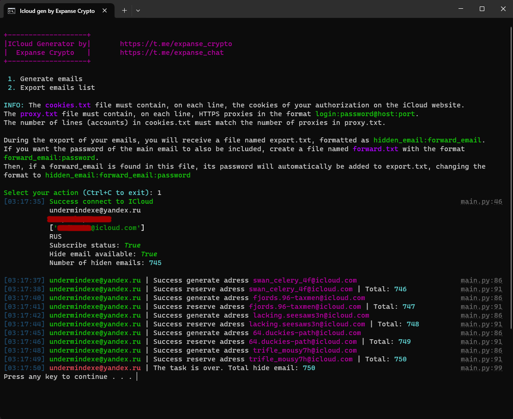

# iCloud generator (hidden email)

[🇬🇧 English](#english) | [🇷🇺 Русский](#русский)

## English

This program allows you to automatically **generate hidden email addresses** using one or more accounts.
(With an iCloud+ subscription, you can generate up to 750 hidden emails per account.)
It also allows you to export the data in a convenient format, showing the hidden email address, the forwarding email, and the password for that forwarding email.

---

### Core features

- Collecting information about the account/iCloud+ subscription activity
- Generating hidden email addresses
- Exporting all email addresses
- Deleting all email addresses (coming soon)

### Compatibility

The program **works on Windows, Linux, and MacOS**

### Install

**You can use the ready-made exe build or install it manually**

- `pip install -r requirements.txt`

## Start

- `python main.py`

### Install in virtual enviroment

- `python -m venv venv`
- `venv\Scripts\activate`
- `pip install -r requirements.txt`

### Start in virtual enviroment

- `venv\Scripts\activate`
- `python main.py`

### Alternatively, use the INSTALL.bat and START.bat files.

### Contact

[Telegram](https://t.me/UnderMindExe)

---

## Русский

Эта программа позволит вам в автоматическом режиме, с использованием одного или нескольких аккаунтов генерировать скрытые почтовые адреса (С подпиской iCloud+ это 750 штук на аккаунт). А также экспортировать, сразу с видом, удобный для использования, где будет указан этот адрес, на какую почту перенаправляется и пароль от той почты.

---

### Основные функции

- Сбор информации об аккаунте/активности подписки iCloud+
- Генерация скрытых почтовых адресов
- Экспорт всех почтовых адресов
- Удаление всех почтовых адресов (скоро)

### Совместимость

Программа работает на Windows, Linux и MacOS

### Установка

**Вы можете использовать готовый exe билд, либо установить в ручную**

- `pip install -r requirements.txt`

### Запуск

- `python main.py`

### Установка в виртуальном окружении

- `python -m venv venv`
- `venv\Scripts\activate`
- `pip install -r requirements.txt`

### Запуск в виртуальном окружении

- `venv\Scripts\activate`
- `python main.py`

### Либо используйте INSTALL и START bat файлы

### Контакты

[Telegram](https://t.me/UnderMindExe)
